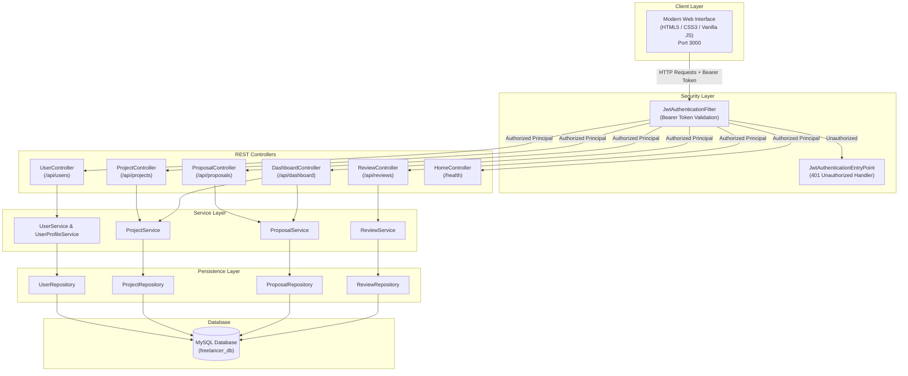
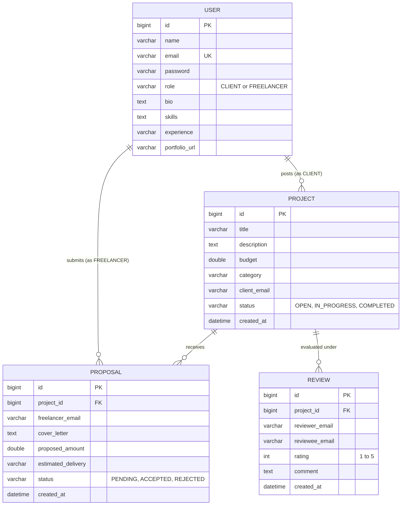
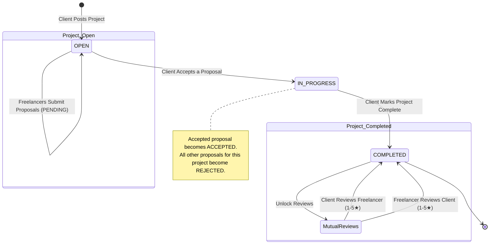
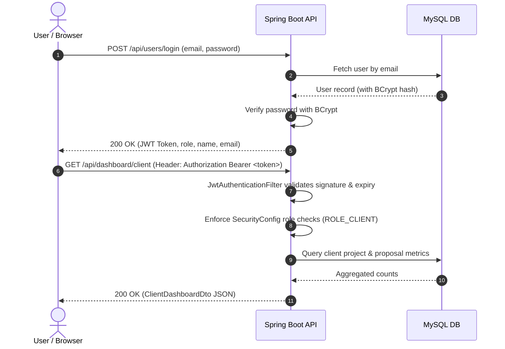

# 🏛️ Freelancer Platform System Architecture

This document describes the high-level system architecture, entity relationships, security workflows, and lifecycle state machines for the Freelancer Platform.

---

## 1. High-Level Architecture Diagram

---

## 2. Entity-Relationship (ER) Model

---

## 3. Project & Proposal Lifecycle State Machine

---

## 4. Authentication & JWT Authorization Flow

